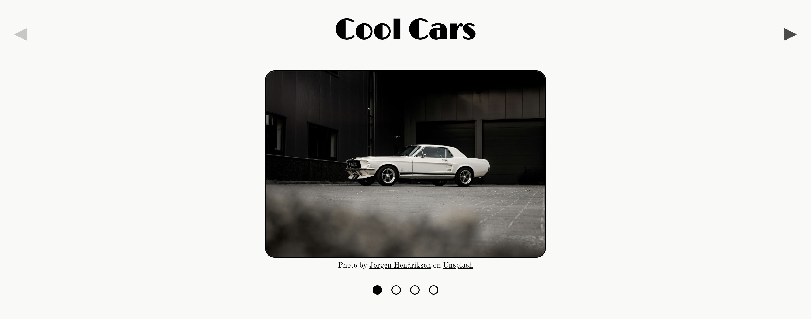

# Image Carousel

A responsive image carousel.

> [!NOTE]
> As of 01/02/2026 these new CSS features are not supported by Safari or Firefox. For a carousel compatible with those browsers, check out this [other repo](https://github.com/BarreraClaudia/image-carousel).

## Tech Stack

<!-- Badges from https://github.com/Ileriayo/markdown-badges -->

